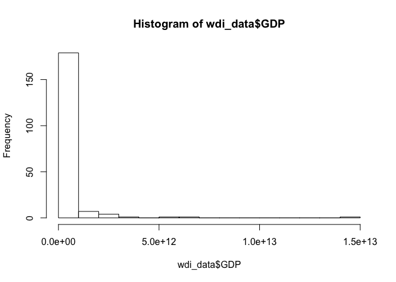
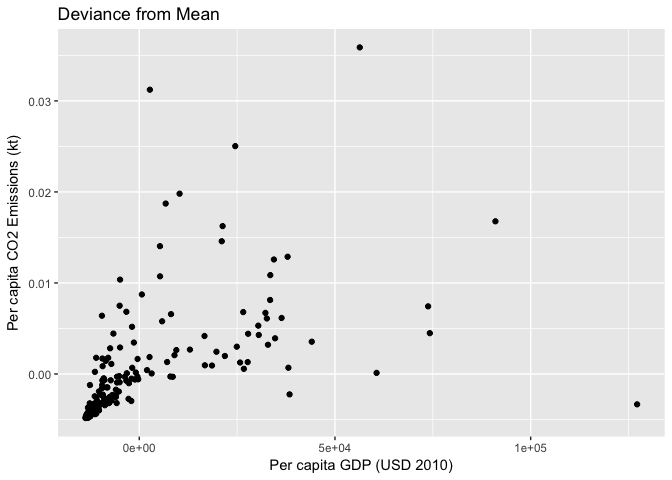
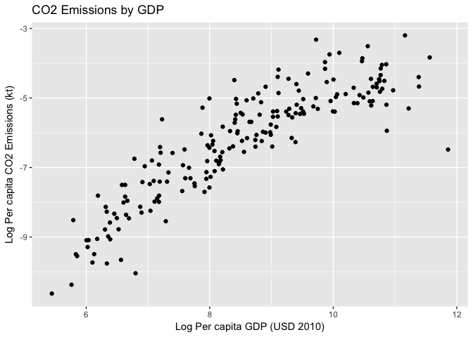

Problem Set 1
================
Anaya Hall

------------------------------------------------------------------------

ARE 212 - Problem Set \#1
-------------------------

Due Feb. 7, 2017

------------------------------------------------------------------------

### PART 1: Theory (Practice Only)

1-3. *come back to this!*

------------------------------------------------------------------------

### PART 2: Applied - Carbon & Income

##### 1. Download World Bank’s **World Development Indicators** (from Data Center): <http://databank.worldbank.org/data/reports.aspx?source=world-development-indicators>

Downloaded Jan. 27, 2018.

##### 2. Load data into R

``` r
rm(list = ls())
mydir <- "~/projects/are212/pset1/"
datadir <- "wdi/"

# Bring in Data
setwd(mydir)
wdi_rawdata <- readr::read_csv(paste0(mydir,datadir,"wdi_carbon_income.csv"), na = ("..")
                            )
#Reshape data long to wide
wdi_df <- as.data.frame(wdi_rawdata)
wide <- reshape(wdi_df, idvar = c("Country Name", "Country Code"), timevar="Series Name", 
                drop = "Series Code", direction = "wide")
```

    ## Warning in reshapeWide(data, idvar = idvar, timevar = timevar, varying =
    ## varying, : multiple rows match for Series Name=: first taken

``` r
#Remove empty column of YEAR
wide <- wide[(-6)]

#Remove incomplete observations
wide <- na.omit(wide)

#Should be 194 countries. Check!
wdi_data <- rename(wide, CO2 = "2010 [YR2010].CO2 emissions (kt)", 
                  GDP =  "2010 [YR2010].GDP (constant 2010 US$)", 
                 POP = "2010 [YR2010].Population, total")
```

There are 194 countries with complete observations for the three series of interest.

##### 3. Calculate a table of showing the sample mean, standard deviation, minimum and maximum for each series:

``` r
summary(wdi_data)
sapply(wdi_data, sd)
```

    ## Warning in var(if (is.vector(x) || is.factor(x)) x else as.double(x), na.rm
    ## = na.rm): NAs introduced by coercion

    ## Warning in var(if (is.vector(x) || is.factor(x)) x else as.double(x), na.rm
    ## = na.rm): NAs introduced by coercion

| Series | CO2 (tk)     | GDP (2010 USD) | POP (persons) |
|--------|--------------|----------------|---------------|
| Mean   | 162317       | 3.364e+11      | 7.066e+6      |
| SD     | 7.630124e+05 | 1.297364e+12   | 1.346430e+08  |
| Min    | 7            | 3.182e+07      | 1.002e+04     |
| Max    | 8776040      | 1.496e+13      | 1.338e+09     |

##### 4. Create a histogram for CO2 and GDP (15 buckets).

``` r
hist(wdi_data$CO2, breaks=15)
```


``` r
hist(wdi_data$GDP, breaks=15)
```




##### 6. Create new variable “Per capita CO2 emissions” called CO2pc.

``` r
wdi_data$CO2pc <- wdi_data$CO2/wdi_data$POP
```

##### 7. Create a new variable “Per capita GDP” GDPpc.

``` r
wdi_data$GDPpc <- wdi_data$GDP/wdi_data$POP
```

##### 8. Plot CO2pc against GDPpc.


##### 9. Create demeaned variables of CO2pc and GDPpc called CO2pcdev and GDPpcdev by subtracting the sample mean from each observation.

``` r
#Get sample mean of per capita CO2 emissions
co2mean <- mean(wdi_data$CO2pc)
#Calculate deviance for each observation
wdi_data$CO2pcdev <- wdi_data$CO2pc - co2mean

#Get sample mean of per capita GDP
gdpmean <- mean(wdi_data$GDPpc)
#Calculate deviance for each obs
wdi_data$GDPpcdev <- wdi_data$GDPpc - gdpmean
```

##### 10. Plot CO2pcdev against GDPpcdev.



##### 11. Create the variables CO2pcln and GDPpcln by taking natural logs of CO2pc and GDPpc.

``` r
#Natural log of CO2pc
wdi_data$CO2pcln <- log(wdi_data$CO2pc)

#Natural log of GDPpc
wdi_data$GDPpcln <- log(wdi_data$GDPpc)
```

##### 12. Plot CO2pcln and GDPpcln.

``` r
ggplot(data=wdi_data, aes(x= GDPpcln, y = CO2pcln)) + geom_point() + ylab("Log Per capita CO2 Emissions (kt)") + xlab("Log Per capita GDP (USD 2010)") + labs(title="CO2 Emissions by GDP")
```



##### 13. Export your data as a comma delimited ascii file.

``` r
write.csv(wdi_data, "wdi_data.csv")
```

------------------------------------------------------------------------

##### 14. Regress CO2pc on GDPpc without an intercept.

``` r
# Function to calculate beta coefficient without an intercept 
b_ols1 <- function(data, y, X) {
  # Require the 'dplyr' package
  require(dplyr)
  
  # Create the y matrix
  y_data <- data %>%
    # Select y variable data from 'data'
    select_(.dots = y) %>%
    # Convert y_data to matrices
    as.matrix()
  
  # Create the X matrix
  X_data <- data %>%
    # Select X variable data from 'data'
    select_(.dots = X) %>%
    # Convert X_data to matrices
    as.matrix()
  
  # Calculate beta hat
  beta_hat <- solve(t(X_data) %*% X_data) %*% t(X_data) %*% y_data
  # Change the name of 'ones' to 'intercept'
  rownames(beta_hat) <- c(X)
  # Return beta_hat
  return(beta_hat)
}

# Regress CO2pc on GDPpc without an intercept
b_ols1(data=wdi_data, y="CO2pc", X="GDPpc")
```

    ##              CO2pc
    ## GDPpc 2.233062e-07

###### Write down your regression coefficient.

*Regression coefficient: 2.233062e-07*

Now multiply CO2pc by 1000, changing its units to tons instead of kilotons. Run the regression again.

``` r
wdi_data$CO2pc_tons <- wdi_data$CO2pc*1000 #Change units of per capita CO2 conc to tons

# Rerun regression
b_ols1(data=wdi_data, y="CO2pc_tons", X="GDPpc")
```

    ##         CO2pc_tons
    ## GDPpc 0.0002233062

###### What has happened to the coefficient on GDPpc?

*Coefficient GDPpc is now 0.0002233062, four orders of magnitude larger*

Now divide GDPpc by 1000, changing its units to thousands of $ instead of $. Run the regression again.

``` r
wdi_data$GDPpc_thous <- wdi_data$GDPpc*(1/1000)

b_ols1(data=wdi_data, y="CO2pc_tons", X="GDPpc_thous")
```

    ##             CO2pc_tons
    ## GDPpc_thous  0.2233062

###### What has happened to the coefficient on GDPpc? (Optional: Calculate the R2 for each regression and see what happens. Any changes? What happens to the sums of squares?) Keep both variables in the new units.

*Coefficient is now 0.2233062, four more orders of magnitude larger*

##### 15. For the last regression from the previous part calculate and report n, degrees of freedom, b, Ru2c, R2, R ̄2, AIC, SIC, s2.

``` r
sample_size <- function(data) {
  
  #some stuff
  n <- count(data)
  return(n)
}

deg_freedom <- function(data) {
  n <- count(data)
  df <- n - count(x)
}

# b?
# 
# rsq_uc <- function() {}
# 
# rsq <- function() {}
# 
# adj_rsq <- function() {}
# 
# akaikeIC <- function() {}
#   
# bsIC <- function() {}
# 
# std_error <- function() {}
# 
# pred_vals <- 


count(wdi_data)
```

    ## # A tibble: 1 x 1
    ##       n
    ##   <int>
    ## 1   194

Then calculate the predicted values and plot them against the actual CO2pc. Calculate your residuals and plot them against GDPpc. Do not submit the graphs, but briefly talk about what these figures tell you about fit and the validity of the constant variance assumption. Also - are there any outliers?

##### 16. Regress CO2pc on GDPpc and an intercept.

Calculate and report n, df = n − k, b, Ru2c, R2, R ̄2, AIC, SIC, s2. Then calculate the predicted values and plot them against CO2pc. Calculate your residuals and plot them against GDPpc. Do not submit the graphs. Use the pictures and results to talk about how the fit has improved or not.

##### 17. Regress CO2pc on an intercept, GDPpc and GDPpc2, where GDPpc2 is the square of GNIpc.

Calculate and report n, degrees of freedom, b, Ru2c, R2, R ̄2, AIC, SIC, s2. Then calculate the predicted values and plot them against CO2pc. Calculate your residuals and plot them against GDPpc. Do not submit the graphs. Use the pictures and results to talk about how the fit has improved or not. Also briefly address whether including GDPpc2 in the regression is violates any of our assumptions. Does this specification make economic sense?

##### 18. The power of FWT.

Calculate demeaned versions of CO2pc, GDPpc and GDPpc2. Regress the demeaned CO2pc on the demeaned GDPpc and GDPpc2. Compare your parameter estimates to the result from the previous part.

##### 19. More power of FWT.

Regress CO2pc on GDPpc. Save your residuals. Now regress the columns of \[i GDPpc2\] on GDPpc. Save your residuals (an n × 2 matrix of residuals). Now regress the first vector of n residuals on the (n × 2) matrix of residuals. Report your findings.
