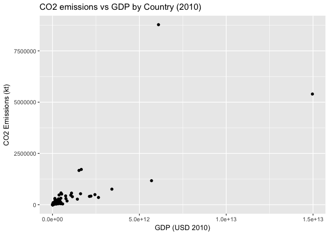

Problem Set 1
================
Anaya Hall

------------------------------------------------------------------------

ARE 212 - Problem Set \#1
-------------------------

Due Feb. 7, 2017

------------------------------------------------------------------------

### PART 1: Theory

*Practice Only*

------------------------------------------------------------------------

### PART 2: Applied - Carbon & Income

##### 1. Download World Bank’s **World Development Indicators** (from Data Center): <http://databank.worldbank.org/data/reports.aspx?source=world-development-indicators>

Downloaded Jan. 27, 2018.

##### 2. Load data into R

``` r
rm(list = ls())
mydir <- "~/projects/are212/pset1/"
datadir <- "wdi/"

# Bring in Data
setwd(mydir)
wdi_rawdata <- readr::read_csv(paste0(mydir,datadir,"wdi_carbon_income.csv"), na = ("..")
                            )
#Reshape data long to wide
wdi_df <- as.data.frame(wdi_rawdata)
wide <- reshape(wdi_df, idvar = c("Country Name", "Country Code"), timevar="Series Name", 
                drop = "Series Code", direction = "wide")
```

    ## Warning in reshapeWide(data, idvar = idvar, timevar = timevar, varying =
    ## varying, : multiple rows match for Series Name=: first taken

``` r
#Remove empty column of YEAR
wide <- wide[(-6)]

#Remove incomplete observations
wide <- na.omit(wide)

#Should be 194 countries. Check!
wdi_data <- rename(wide, CO2 = "2010 [YR2010].CO2 emissions (kt)", 
                  GDP =  "2010 [YR2010].GDP (constant 2010 US$)", 
                 POP = "2010 [YR2010].Population, total")
```

There are 194 countries with complete observations for the three series of interest.

##### 3. Calculate a table of showing the sample mean, standard deviation, minimum and maximum for each series:

``` r
summary(wdi_data)
sapply(wdi_data, sd)
```

    ## Warning in var(if (is.vector(x) || is.factor(x)) x else as.double(x), na.rm
    ## = na.rm): NAs introduced by coercion

    ## Warning in var(if (is.vector(x) || is.factor(x)) x else as.double(x), na.rm
    ## = na.rm): NAs introduced by coercion

| Series | CO2 (kt)     | GDP (USD (2010) | POP (persons) |
|--------|--------------|-----------------|---------------|
| Mean   | 162317       | 3.364e+11       | 3.522e+07     |
| SD     | 7.630124e+05 | 1.297364e+12    | 1.346430e+08  |
| Min    | 7            | 3.182e+07       | 1.002e+04     |
| Max    | 8776040      | 1.496e+13       | 1.338e+09     |

##### 4. Create a histogram for CO2 and GDP (15 buckets).

``` r
hist(wdi_data$CO2, breaks=15)
```


``` r
hist(wdi_data$GDP, breaks=15)
```


##### 5. Plot CO2 against GDP.

``` r
ggplot(data=wdi_data, aes(x= GDP, y = CO2)) + geom_point() + ylab("CO2 Emissions (kt)") + xlab("GDP (USD 2010)") + labs(title="CO2 emissions vs GDP by Country (2010)")
```



##### 6. Create new variable “Per capita CO2 emissions” called CO2pc.

``` r
wdi_data$CO2pc <- wdi_data$CO2/wdi_data$POP
```

##### 7. Create a new variable “Per capita GDP” GDPpc.

``` r
wdi_data$GDPpc <- wdi_data$GDP/wdi_data$POP
```

##### 8. Plot CO2pc against GDPpc.


##### 9. Create demeaned variables of CO2pc and GDPpc called CO2pcdev and GDPpcdev by subtracting the sample mean from each observation.

``` r
#Get sample mean of per capita CO2 emissions
co2mean <- mean(wdi_data$CO2pc)
#Calculate deviance for each observation
wdi_data$CO2pcdev <- wdi_data$CO2pc - co2mean

#Get sample mean of per capita GDP
gdpmean <- mean(wdi_data$GDPpc)
#Calculate deviance for each obs
wdi_data$GDPpcdev <- wdi_data$GDPpc - gdpmean
```

##### 10. Plot CO2pcdev against GDPpcdev.


##### 11. Create the variables CO2pcln and GDPpcln by taking natural logs of CO2pc and GDPpc.

``` r
#Natural log of CO2pc
wdi_data$CO2pcln <- log(wdi_data$CO2pc)

#Natural log of GDPpc
wdi_data$GDPpcln <- log(wdi_data$GDPpc)
```

##### 12. Plot CO2pcln and GDPpcln.

``` r
ggplot(data=wdi_data, aes(x= GDPpcln, y = CO2pcln)) + geom_point() + ylab("Log Per capita CO2 Emissions (kt)") + xlab("Log Per capita GDP (USD 2010)") + labs(title="Logged CO2 Emissions vs Logged GDP by Country")
```


##### 13. Export your data as a comma delimited ascii file.

``` r
write.csv(wdi_data, "wdi_data.csv")
```

------------------------------------------------------------------------

##### 14. Regress CO2pc on GDPpc without an intercept.

``` r
# Function to calculate beta coefficient and measures of fit (with or without intercept) 
b_ols <- function(data, y, X, include_i=TRUE) {
  # Require the 'dplyr' package
  require(dplyr)
  
  # Create the y matrix
  y_data <- data %>%
    # Select y variable data from 'data'
    select_(.dots = y) %>%
    #if(include_i)
    # Convert y_data to matrices
    as.matrix()
  
  # Select X variable data from 'data'
  X_data <- select_(data, .dots = X)
  # Convert X_data to matrices
  X_data <- as.matrix(X_data)
  # If include intercept == TRUE: Add a column of ones to front
  if(include_i) {X_data <- cbind(1, X_data) 
      colnames(X_data)[1] <- "ones"}
  
  # Calculate beta hat
  beta_hat <- solve( t(X_data) %*% X_data ) %*% t(X_data) %*% y_data
  # Change the name of 'ones' to 'intercept'
  if(include_i){
      rownames(beta_hat) <- c("intercept", X)
  }
  else
    rownames(beta_hat) <- c(X)

  n <- nrow(X_data)
  k <- ncol(X_data)
  
  dof <- n - k 
  
  # Uncentered R2
  e <- (diag(n) - X_data %*% solve(t(X_data) %*% X_data) %*% t(X_data)) %*% y_data
  ruc_sq <- (1- ((t(e) %*% e)) / (t(y_data) %*% y_data))
  
  # Centered R2
  i <- rep(1, n)
  A <- (diag(i) - (1/n)*(i) %*% t(i))
  y_star = A %*% y_data
  
  # Method 1: Not correct if there's no intercept!!  
  r_sq_alt <- 1 - ( (t(e) %*% e) / (t(y_star) %*% y_star) )
  # ssr <- (t(e) %*% e)   # included just for testing
  
  # Method 2: Always correct!
  x_star <- A %*% X_data
  ssm <- t(beta_hat) %*% t(x_star) %*% x_star %*% beta_hat
  sst <- (t(y_star) %*% y_star)  
  r_sq <- (ssm/sst)
  
  #Adjusted R2
  adj_r2 <- 1 - (((n-1)/(n-k))*(1-r_sq))
  
  #AIC
  aic <- log((t(e) %*% e)/n) + 2*(k/n)
  
  #SIC
  sic <- log((t(e) %*% e)/n) + (k/n)*(log(n))

  # s2
  s2 <- (t(e) %*% e)/(n-k)
  
  # Residuals
  res <<- e
  
  # Predicted Values
  y_hat <<- X_data %*% beta_hat

  reg_list <- c("Beta_hat" = beta_hat, "n" = n, "dof" = dof, "ruc_sq" = ruc_sq, "r_sq" = r_sq, "Adj_R2" = adj_r2, "AIC" = aic, "SIC" = sic, "s2" = s2, "SST" = sst)

  return(reg_list)

  }

# Regress CO2pc on GDPpc without an intercept
b_ols(data=wdi_data, y="CO2pc", X="GDPpc", include_i = FALSE) 
```

    ##      Beta_hat             n           dof        ruc_sq          r_sq 
    ##  2.233062e-07  1.940000e+02  1.930000e+02  4.904832e-01  5.370087e-01 
    ##        Adj_R2           AIC           SIC            s2           SST 
    ##  5.370087e-01 -1.032573e+01 -1.030888e+01  3.261076e-05  7.766047e-03

``` r
wdi_data$residuals <- res
wdi_data$pred_vals <- y_hat
```

###### Write down your regression coefficient.

*Regression coefficient on GDPpc: 2.233062e-07*

Now multiply CO2pc by 1000, changing its units to tons instead of kilotons. Run the regression again.

``` r
wdi_data$CO2pc_tons <- wdi_data$CO2pc*1000 #Change units of per capita CO2 conc to tons

# Rerun regression
b_ols(data=wdi_data, y="CO2pc_tons", X="GDPpc", include_i = FALSE)
```

    ##     Beta_hat            n          dof       ruc_sq         r_sq 
    ## 2.233062e-04 1.940000e+02 1.930000e+02 4.904832e-01 1.895649e-01 
    ##       Adj_R2          AIC          SIC           s2 
    ## 1.895649e-01 3.489784e+00 3.506628e+00 3.261076e+01

###### What has happened to the coefficient on GDPpc?

*Coefficient on GDPpc is now 0.0002233062, three orders of magnitude larger*

Now divide GDPpc by 1000, changing its units to thousands of USD instead of millions USD. Run the regression again.

``` r
wdi_data$GDPpc_thous <- wdi_data$GDPpc*(1/1000)

b_ols(data=wdi_data, y="CO2pc_tons", X="GDPpc_thous", include_i = FALSE)
```

    ##    Beta_hat           n         dof      ruc_sq        r_sq      Adj_R2 
    ##   0.2233062 194.0000000 193.0000000   0.4904832   0.1895649   0.1895649 
    ##         AIC         SIC          s2 
    ##   3.4897836   3.5066283  32.6107610

###### What has happened to the coefficient on GDPpc? (Optional: Calculate the R2 for each regression and see what happens. Any changes? What happens to the sums of squares?) Keep both variables in the new units.

*Coefficient is now 0.2233062, three more orders of magnitude larger. *

*R^2 and sum of squares both stay the same for each regression.*

##### 15. For the last regression from the previous part calculate and report n, degrees of freedom, b, Ru2c, R2, R ̄2, AIC, SIC, s2.

``` r
b_ols(data=wdi_data, y="CO2pc_tons", X="GDPpc_thous", include_i = FALSE)
```

    ##    Beta_hat           n         dof      ruc_sq        r_sq      Adj_R2 
    ##   0.2233062 194.0000000 193.0000000   0.4904832   0.1895649   0.1895649 
    ##         AIC         SIC          s2 
    ##   3.4897836   3.5066283  32.6107610

Then calculate the predicted values and plot them against the actual CO2pc. Calculate your residuals and plot them against GDPpc. Do not submit the graphs, but briefly talk about what these figures tell you about fit and the validity of the constant variance assumption. Also - are there any outliers?

*These figures indicate that the constant variance assumption may not hold- looknig at the residual plot we can see much larger variance at higher values of X.* *The figure with the predicted values plotted against the actual values suggests that our fit could be improved, since they do not align well along a y=x line. Further, there are several outliers!*

##### 16. Regress CO2pc on GDPpc and an intercept.

Calculate and report n, df = n − k, b, Ru2c, R2, R ̄2, AIC, SIC, s2. Then calculate the predicted values and plot them against CO2pc. Calculate your residuals and plot them against GDPpc. Do not submit the graphs. Use the pictures and results to talk about how the fit has improved or not.

``` r
# Run regression with intercept
b_ols(data=wdi_data, y="CO2pc_tons", X="GDPpc_thous", include_i = TRUE)
```

    ##    Beta_hat1    Beta_hat2            n          dof       ruc_sq 
    ##    2.5314095    0.1668361  194.0000000  192.0000000    0.5597562 
    ##         r_sq       Adj_R2          AIC          SIC           s2 
    ##    0.2997503    0.2961032    3.3539586    3.3876479   28.3238120 
    ##          SST 
    ## 7766.0470758

*By visually inspecting the plot, it seems like the fit has improved a little. The uncentered R2 also improved, though the adjusted R2 decreased. As Max mentioned in class, OLS can provide better estimates when the variables are closer in magnitude.*

##### 17. Regress CO2pc on an intercept, GDPpc and GDPpc2, where GDPpc2 is the square of GNDpc.

Calculate and report n, degrees of freedom, b, Ru2c, R2, R ̄2, AIC, SIC, s2. Then calculate the predicted values and plot them against CO2pc. Calculate your residuals and plot them against GDPpc. Do not submit the graphs. Use the pictures and results to talk about how the fit has improved or not. Also briefly address whether including GDPpc2 in the regression is violates any of our assumptions. Does this specification make economic sense?

``` r
wdi_data$GDPpc2 <- (wdi_data$GDPpc_thous)^(2)

b_ols(data=wdi_data, y="CO2pc_tons", X=c("GDPpc_thous", "GDPpc2"), include_i = TRUE)
```

    ##     Beta_hat1     Beta_hat2     Beta_hat3             n           dof 
    ##    1.01533420    0.40118282   -0.00280706  194.00000000  191.00000000 
    ##        ruc_sq          r_sq        Adj_R2           AIC           SIC 
    ##    0.65476959    0.45087813    0.44512816    3.12115137    3.17168526 
    ##            s2           SST 
    ##   22.32725807 7766.04707579

*Adding a squared term for GDPpc does seem to increase the measure of fit of our regression. This does not violate our assumptions, but it does make the result harder to interpret from an economic and real-world sense. How can you hold GDP-squared constant without holding GDP constant?!*

##### 18. The power of FWT.

Calculate demeaned versions of CO2pc, GDPpc and GDPpc2. Regress the demeaned CO2pc on the demeaned GDPpc and GDPpc2. Compare your parameter estimates to the result from the previous part.

``` r
wdi_data$GDPpc2dev <- wdi_data$GDPpc2 - mean(wdi_data$GDPpc2)

b_ols(data=wdi_data, y="CO2pcdev", X=c("GDPpcdev", "GDPpc2dev"), include_i = FALSE)
```

    ##     Beta_hat1     Beta_hat2             n           dof        ruc_sq 
    ##  4.011828e-07 -2.807060e-12  1.940000e+02  1.920000e+02  4.508781e-01 
    ##          r_sq        Adj_R2           AIC           SIC            s2 
    ##  4.508781e-01  4.480181e-01 -1.070467e+01 -1.067098e+01  2.221097e-05 
    ##           SST 
    ##  7.766047e-03

``` r
# Stata notes on FWT:
# regress y on x, record resid as y-star
# regress x2 on x, record resid as x2_star
# regress y-star on X2_star. --> recover your regression estimates!
```

*Parameters are very close, but not exactly the same, as before.*

##### 19. More power of FWT.

Report your findings.

``` r
# Regress CO2pc on GDPpc. Save your residuals
b_ols(data=wdi_data, y="CO2pc_tons", X="GDPpc_thous", include_i = FALSE)
```

    ##     Beta_hat            n          dof       ruc_sq         r_sq 
    ##    0.2233062  194.0000000  193.0000000    0.4904832    0.5370087 
    ##       Adj_R2          AIC          SIC           s2          SST 
    ##    0.5370087    3.4897836    3.5066283   32.6107610 7766.0470758

``` r
co2_star <- res

# Now regress the columns of [i GDPpc2] on GDPpc. Save your residuals (an n × 2 matrix of residuals).
wdi_data$i <- rep(1, 194)
b_ols(data=wdi_data, y="i", X="GDPpc_thous", include_i=FALSE)
```

    ##      Beta_hat             n           dof        ruc_sq          r_sq 
    ##  2.230778e-02  1.940000e+02  1.930000e+02  3.116687e-01  7.236744e+28 
    ##        Adj_R2           AIC           SIC            s2           SST 
    ##  7.236744e+28 -3.631758e-01 -3.463311e-01  6.918978e-01  5.751078e-28

``` r
i_star <- res

b_ols(data=wdi_data, y="GDPpc2", X="GDPpc_thous", include_i=FALSE)
```

    ##     Beta_hat            n          dof       ruc_sq         r_sq 
    ## 7.143648e+07 1.940000e+02 1.930000e+02 7.674316e-01 5.831731e-01 
    ##       Adj_R2          AIC          SIC           s2          SST 
    ## 5.831731e-01 4.142491e+01 4.144175e+01 9.735901e+17 7.318506e+20

``` r
gdp_star <- res

new_data <- as.data.frame(cbind(co2_star, i_star, gdp_star))
colnames(new_data) <- c("co2_star", "i_star", "gdp_star")
```

``` r
# Now regress the first vector of n residuals on the (n × 2) matrix of residuals
# b_ols(data=new_data, y="co2_star", X=c("i_star", "gdp_star"), include_i = FALSE)
```

    Beta_hat1  | Beta_hat2   |          n    |       dof    |    ruc_sq    |      r_sq    |   Adj_R2  |

1.01533420 | -0.00280706 | 194.00000000 | 192.00000000 | 0.32243570 | 0.25247946 | 0.24858612 |

*Aha! I get the same results as the regression in question 17! (this works when I run the code in R, but for some reason not when I knit.... so I've copied the results here!*
